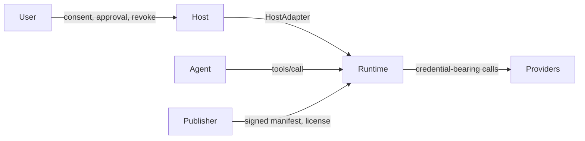
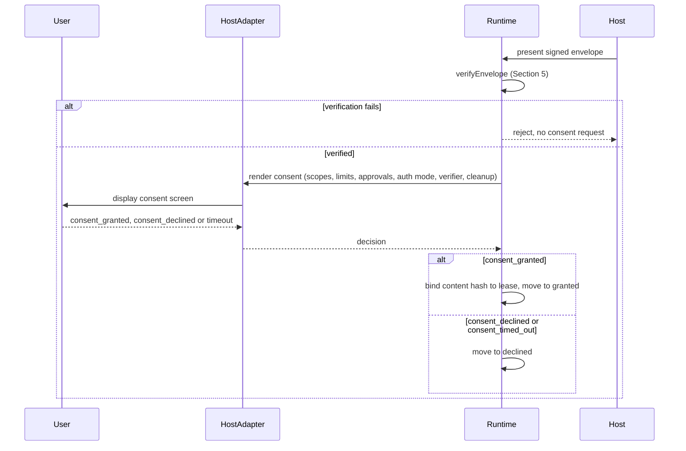
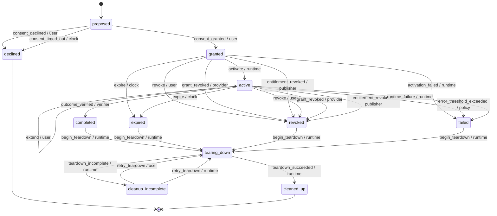
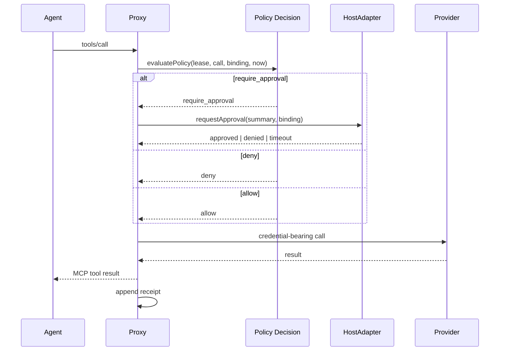
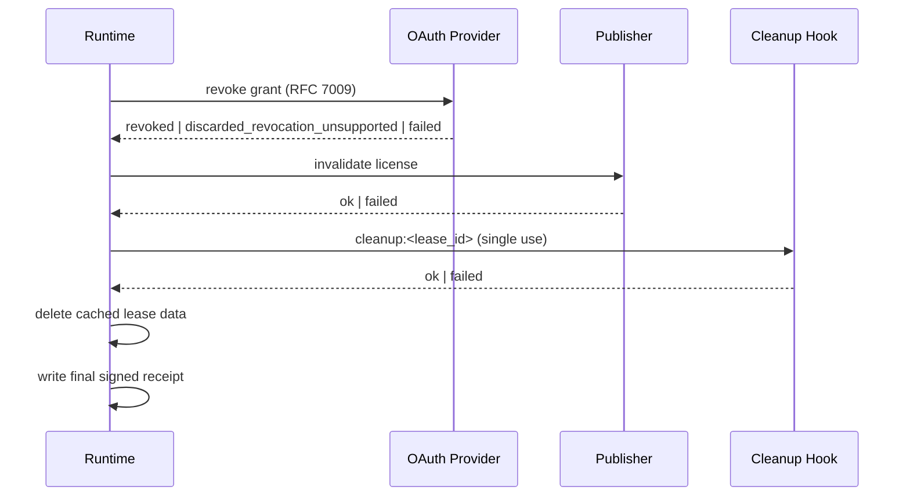

# Agent Lease Protocol (ALP), version alp/0.1

## 1. Introduction

Stint is a lease runtime for specialist AI agents. This document, the Agent Lease Protocol (ALP), specifies the human-facing lifecycle of an agent: install, run a scoped job, and uninstall cleanly.

The protocol's scope is exactly these three phases. Install means a user reviews a publisher's manifest and grants a lease. A scoped job means the agent operates only within the bounds the lease states, enforced by code the agent cannot influence. Uninstall means the lease ends, for any reason, and every credential the runtime holds on the agent's behalf is revoked, with the teardown honestly receipted.

ALP sits on top of two existing specifications and fills the gap each one leaves out of scope.

Rationale: the Model Context Protocol (MCP) defines how an agent discovers and calls tools, but it leaves user consent, revocation and uninstall out of scope; a host that implements only MCP has no normative way to say "this agent's access ends here, and here is proof it actually ended." OAuth 2.1 gives an agent's runtime delegated, scoped access tokens for a customer's own resources, but it has no concept of a lease: no bound duration, no bound job, and no teardown obligation tied to the lease's owner rather than to the token's issuer.

ALP serves two audiences equally. Platform builders host communities of agents and embed a runtime implementation with their own consent and approval user experience. Agent publishers ship specialist agents with a signed manifest, and where applicable a publisher-issued license, and in return receive attested receipts proving what their agent did.

The core guarantee this document specifies: a prompt-injected or otherwise misbehaving agent can never act outside the lease a user granted. Every tool call an agent makes is decided by code outside the model, running in a proxy the agent cannot bypass; the agent never holds a real credential that would let it act directly against a resource.

Non-goals: this document does not specify a marketplace or agent discovery mechanism; multi-agent delegation of a single lease to another agent; prompt-injection detection (the protocol's guarantee is that injection cannot exceed the lease, not that injection is detected or prevented); sandboxing of the agent process's own network egress (Section 13 documents this as a trust limit, not a mechanism this protocol provides); or a general-purpose policy DSL (the access vocabulary is the fixed set defined in Section 2, not an extensible rule language).

## 2. Conventions and Terminology

The key words "MUST", "MUST NOT", "REQUIRED", "SHALL", "SHALL NOT", "SHOULD", "SHOULD NOT", "RECOMMENDED", "MAY" and "OPTIONAL" in this document are to be interpreted as described in BCP 14 [RFC2119] [RFC8174] when, and only when, they appear in all capitals, as shown here.

Sections and notes beginning "Rationale:" are non-normative; they explain the reasoning behind a requirement but impose no obligation of their own.

Some wire-level details are not yet designed at this stage of the specification. Each such place carries an explicit marker, for example `[OPEN: Phase 2]`, naming the phase of the Stint project's own build that will define it. Implementations MUST NOT invent an interoperable format for anything marked with such a bracketed OPEN marker; a runtime or publisher MAY use a private, non-interoperable representation internally, but MUST NOT advertise cross-implementation compatibility of that representation until this document replaces the marker with a normative definition.

The following terms are used throughout this document:

- **Lease**: a bounded grant of access from a user to an agent, scoped to specific resources, access classes and limits, for at most a bounded duration.
- **Manifest**: a publisher-authored document describing an agent's job, requested scopes, limits, approvals and auth requirements, validated against the canonical manifest schema.
- **Signed Manifest Envelope**: a manifest plus a detached publisher signature over the manifest's canonical bytes.
- **Content Hash**: a self-describing hash of a manifest's canonically serialized bytes, bound to a lease at consent.
- **Runtime**: the software implementing this protocol: the state machine, the proxy, the credential vault and the teardown orchestrator. Operated by the user or a neutral party (Section 12).
- **Proxy**: the runtime component that sits between the agent and every system it touches, presenting an MCP server to the agent and enforcing the lease on every tool call.
- **Host**: the application embedding the runtime and presenting it to a user, via its HostAdapter.
- **HostAdapter**: the pluggable interface a host implements to render consent, per-call approval and lifecycle notifications.
- **Agent**: the publisher-authored process that calls tools through the proxy. Untrusted; never an actor in this protocol's transitions (Section 7.2).
- **Publisher**: the party that authors and signs a manifest, and in hosted or hybrid auth mode issues a license.
- **Provider**: the operator of a customer resource (for example a payments API or a spreadsheet API) that issues delegated OAuth grants.
- **Connector Binding**: a runtime-owned mapping from a tool name to a (resource, access class, irreversible) classification. Never derived from the manifest.
- **Resource**: an opaque identifier for something an agent can be granted access to, resolved by connector bindings.
- **Access Class**: one of the fixed values `read`, `write`, `send` or `pay`.
- **Grant**: a delegated OAuth authorization acquired from a provider for a specific resource.
- **License**: a publisher-issued, offline-verifiable token proving entitlement, used in hosted and hybrid auth modes.
- **Receipt**: an append-only record of one decision or outcome, hash-chained with every other receipt in its chain.
- **Verified Chain**: the hash chain of receipts the runtime itself observed and can prove.
- **Attested Chain**: the hash chain of receipts the runtime relays on trust from the publisher, without independent proof.
- **Checkpoint**: a signed statement summarizing a chain's head at a point in time, used to detect truncation or tampering.
- **Teardown**: the fixed, ordered sequence that runs whenever a lease ends, ending in a final signed receipt.
- **Actor**: the party the runtime attributes a transition to: `user`, `verifier`, `policy`, `clock`, `provider`, `publisher` or `runtime`.
- **Event**: the named occurrence that drives a lease from one state to another, as listed in Section 7.3.

## 3. Protocol Overview

ALP describes a small set of roles interacting around one lease at a time.

- The **user** grants and can end a lease, and is the only actor who can extend one.
- The **host** embeds the runtime and renders every consent and approval decision through its **HostAdapter**; the host trusts the runtime to enforce the lease, and the user trusts the host to render consent faithfully.
- The **runtime** is the software implementing this protocol. It runs an MCP **proxy** between the agent and every resource the agent might touch, holds the lease state machine, and orchestrates teardown.
- The **agent** is the publisher-authored process that calls tools through the proxy. The agent never holds a real credential: no OAuth access token, no license, no cleanup token. Every tool call the agent makes is decided by code outside the model, running in the proxy, which the agent cannot see or influence.
- The **publisher** authors and signs the manifest, and in hosted or hybrid auth mode issues a license.
- **Providers** operate the customer resources (a payments API, a spreadsheet API, and so on) that the agent's job touches, and issue delegated OAuth grants.

A short lifecycle walk-through: the host presents a publisher's signed manifest to the user (Section 6). If the user consents, the runtime binds the manifest's content hash to a new lease, acquires any delegated OAuth grants and any publisher license the auth mode requires, and activates the lease. While active, every tool call the agent makes passes through the proxy, which resolves the call to a runtime-owned connector binding, checks the lease's scopes and limits, and either allows it, denies it, or asks the user for approval through the HostAdapter. The lease ends for one of several reasons (Section 7), after which teardown (Section 10) runs its fixed sequence, and every step is honestly recorded in the receipt log (Section 11), whether it succeeds or not.



## 4. Manifest

A manifest is the publisher-authored document a runtime validates before requesting consent. The canonical schema is [spec/manifest.schema.json](manifest.schema.json) (JSON Schema draft-07); this section explains every field in prose and does not duplicate the schema. An implementation MUST validate a manifest against that schema, including its conditional (`if`/`then`) rules and the semantic rules stated below that the schema itself cannot express.

Every top-level field, in schema order:

- `spec_version`: the literal string `"alp/0.1"`. A runtime MUST reject any other value; this document defines no version negotiation.
- `agent`: `{ id, name, description? }`. `id` is an `Identifier` (the fixed safe charset `^[a-z0-9](?:[a-z0-9._-]{0,126}[a-z0-9])?$`, chosen so it can be rendered into a consent screen without risk of a display-spoofing sequence, Section 14); `name` and the optional `description` are short human-readable strings.
- `publisher`: `{ id, name }`, using the same `Identifier` charset for `id`. The publisher identity claimed here MUST match the identity the envelope's signature attests to (Section 5); a manifest is never trusted on `publisher.id` alone.
- `version`: the agent's own semantic version string (SemVer 2.0.0), a field distinct from the protocol's own `spec_version`.
- `job`: `{ description, verifier }`. `verifier` is a tagged union of exactly three types, discriminated by its own `type` field, and closed: a value combining fields from two branches (for example a `resource_query` verifier that also carries a `user_confirm` `prompt`) MUST be rejected, not silently accepted by discarding the extra field.
  - `resource_query`: `{ type: "resource_query", resource, predicate }`. The runtime evaluates `predicate` against `resource` through the proxy, using its own held credentials; `predicate` is a closed aggregate-and-compare grammar defined normatively in Section 7.6, never arbitrary code.
  - `user_confirm`: `{ type: "user_confirm", prompt }`. The runtime asks the user, through the HostAdapter, whether the job's outcome is acceptable.
  - `none`: `{ type: "none" }`. The lease can never reach `completed`; it can only end by expiry or by a user or policy action (Section 7.4).
- `scopes`: a non-empty list of `{ resource, access }`. `resource` is an opaque `Identifier` resolved only by a runtime-owned connector binding (Section 9); the manifest never names a tool, and nothing in a manifest can change a tool's classification. `access` is a non-empty, duplicate-free list drawn only from the fixed vocabulary `read`, `write`, `send`, `pay`; there is no free-form scope string and no way for a manifest to introduce a fifth access class.
- `lease`: `{ max_duration_seconds }`, an integer number of seconds bounding the lease's lifetime from grant to expiry (Section 7.5). Every duration and window in a manifest is an integer count of seconds; this document defines no ISO 8601 duration syntax anywhere.
- `limits`: `{ max_actions, actions_per_hour?, spend?, error_threshold? }`, enforced per lease (Section 9). `max_actions` is a hard cap on the total number of actions across the lease's lifetime; `actions_per_hour` is evaluated over a sliding 3600-second window; `spend` is `{ amount_minor, currency }`, an integer count of minor currency units, never a float, plus a three-letter currency code, tracked against a single currency per lease; `error_threshold` is `{ count, window_seconds }`, ending the lease in `failed` when exceeded.
- `approvals`: `{ require_for, timeout_seconds }`. `require_for` is drawn only from the fixed vocabulary `send`, `pay`, `irreversible`; `pay` always requires approval even when a manifest omits it from `require_for`, and a runtime MAY add approval requirements beyond what the manifest states but MUST NOT remove one the manifest or this rule requires (Section 9). A timed-out approval denies.
- `auth`: `{ mode?, delegated?, hosted? }`. `mode` is one of `delegated`, `hosted` or `hybrid`; `hybrid` is the default when `mode` is absent, and an omitted mode is held to exactly hybrid's requirements, not a relaxed subset of them. `delegated` is required whenever `mode` is `delegated` or `hybrid`; `hosted` is required whenever `mode` is `hosted` or `hybrid` (Section 8).
- `cleanup`: either `null` (no publisher cleanup hook) or `{ hook, publisher_retains }`. `hook` is `{ url }`, an `https://` URL, or a loopback `http://` URL for local development, called with a single-use cleanup token during teardown (Section 10). `publisher_retains` is one of `none`, `aggregates`, `job_outputs` or `customer_data`, shown to the user at consent (Section 6); this value, and any cleanup-hook behavior it describes, is an attested publisher claim, never a guarantee the runtime independently verifies (Section 13).
- `x-` prefixed keys: any property name starting with `x-`, at any object node in the manifest, is publisher metadata that MUST be ignored for every enforcement decision and MUST be ignored when a runtime decides whether a manifest's requirements are satisfied; it is display and audit metadata only (Section 9).

Two conditional rules apply across the fields above: any manifest whose `scopes` include a `pay` access class MUST also carry `limits.spend`; `auth.delegated` MUST be present when `auth.mode` is `delegated` or `hybrid`, and `auth.hosted` MUST be present when `auth.mode` is `hosted` or `hybrid` (an absent `auth.mode` is treated exactly as `hybrid` for both rules, never as an exemption from either).

Two semantic rules apply after schema validation passes, since neither is expressible in JSON Schema alone: every resource named in an `auth.delegated` entry's `resources` list MUST also appear as some scope's `resource`, so a delegated grant can never reach a resource the manifest did not also scope; and every scope's `resource` MUST be unique within `scopes`, so a manifest cannot declare the same resource twice with different access lists.

**Annotated example.** The following manifest is exactly the `payment-reconciler` manifest shipped as [spec/vectors/valid/payment-reconciler.json](vectors/valid/payment-reconciler.json); an automated check keeps this example and that vector byte-for-byte identical.

```json
{
  "spec_version": "alp/0.1",
  "agent": {
    "id": "payment-reconciler",
    "name": "Payment Reconciler",
    "description": "Reconciles Paystack transactions against the orders sheet."
  },
  "publisher": {
    "id": "reconciler-labs.example",
    "name": "Reconciler Labs"
  },
  "version": "0.1.0",
  "job": {
    "description": "Match settled Paystack transactions to open orders and mark matched orders as paid.",
    "verifier": {
      "type": "resource_query",
      "resource": "sheets.orders",
      "predicate": "count(rows where status = 'reconciled') >= 1"
    }
  },
  "scopes": [
    {
      "resource": "paystack.transactions",
      "access": [
        "read"
      ]
    },
    {
      "resource": "sheets.orders",
      "access": [
        "read",
        "write"
      ]
    }
  ],
  "lease": {
    "max_duration_seconds": 3600
  },
  "limits": {
    "max_actions": 500,
    "actions_per_hour": 300,
    "error_threshold": {
      "count": 5,
      "window_seconds": 300
    }
  },
  "approvals": {
    "require_for": [
      "irreversible"
    ],
    "timeout_seconds": 120
  },
  "auth": {
    "mode": "hybrid",
    "delegated": [
      {
        "provider": "paystack",
        "resources": [
          "paystack.transactions"
        ]
      },
      {
        "provider": "google_sheets",
        "resources": [
          "sheets.orders"
        ]
      }
    ],
    "hosted": {
      "license_issuer": "reconciler-labs.example",
      "kid": "2026-09"
    }
  },
  "cleanup": {
    "hook": {
      "url": "https://reconciler-labs.example/alp/cleanup"
    },
    "publisher_retains": "aggregates"
  }
}
```

1. `auth.mode` is `hybrid`: the agent needs both a publisher-issued license (entitlement to run at all) and delegated OAuth grants (access to the customer's own Paystack and spreadsheet accounts), so both `auth.delegated` and `auth.hosted` are present.
2. The `paystack.transactions` scope is read-only (`access: ["read"]`); nothing in this manifest ever writes to Paystack.
3. The `sheets.orders` scope grants both `read` and `write`, matching the job's description of marking matched orders as paid.
4. `job.verifier` is `resource_query`: the runtime confirms the job's outcome itself, by evaluating `predicate` against `sheets.orders` through the proxy, rather than trusting the agent's own claim of being done or asking the user to confirm.
5. `limits.error_threshold` ends the lease in `failed` after 5 denied calls or upstream errors within a 300-second window; `limits.spend` is absent because no scope here carries the `pay` access class.
6. `approvals.require_for` lists only `irreversible`; no scope carries `pay`, so this manifest never triggers the always-approve rule for `pay`, but an irreversible action, for example marking an order paid, still requires out-of-band approval.
7. `cleanup.publisher_retains` is `"aggregates"`: Reconciler Labs claims it retains only aggregate statistics after teardown, not raw transaction or order data. As stated above, this is an attested publisher claim; the runtime has no independent way to confirm it (Section 13, Section 6).

## 5. Signed Manifest Envelope and Content Hash

A publisher distributes a manifest as a signed envelope: `{ manifest, signature: { alg, kid, sig } }`. The hash and the signature both cover the `manifest` member only; nothing outside `manifest` is signed, so the envelope itself carries no extension fields and no publisher-supplied metadata that could ride along unsigned.

The content hash of a manifest is `"jcs-sha256:"` followed by the lowercase hexadecimal SHA-256 digest of the UTF-8 bytes produced by serializing the manifest object under RFC 8785, the JSON Canonicalization Scheme (JCS). For example, the annotated manifest in Section 4 hashes to:

```
jcs-sha256:32de102e74d3141a3770c679871dae312691fb3ba522d3f3594f24489c6c704a
```

Rationale: the prefix names both the canonicalization scheme and the digest algorithm, so an implementer cannot mistake this value for a hash of the manifest's raw file bytes. A bare `sha256:` prefix, as used for example by OCI image digests, conventionally means exactly that, a hash of uninterpreted bytes, and would invite an implementation to hash whatever bytes it happened to read from disk rather than the one canonical serialization every implementation must agree on.

The signing input is `ASCII(eyJhbGciOiJFZERTQSJ9)` followed by the single ASCII byte `.` followed by `BASE64URL(JCS(manifest))`, where `JCS(manifest)` is the RFC 8785 canonical serialization's UTF-8 bytes. `eyJhbGciOiJFZERTQSJ9` is the fixed, unvarying base64url encoding of the JSON text `{"alg":"EdDSA"}`; it is not computed per manifest and carries no `kid` (the key identifier lives only in the envelope's `signature.kid`, never in the signed header, so the header stays a content-free constant). This signing input is exactly a JWS (RFC 7515) using Appendix F's detached-content form: `eyJhbGciOiJFZERTQSJ9` is the base64url protected header, the payload is `BASE64URL(JCS(manifest))`, and the two are joined by `.` before signing, but the payload itself is never carried in the envelope, only re-derived by every verifier from the manifest it already has. The signature algorithm is EdDSA over Curve25519 (RFC 8032, profiled for JOSE by RFC 8037); `signature.sig` is the base64url encoding of the raw 64-byte Ed25519 signature over the signing input, with no padding, 86 characters.

A runtime verifies a signed envelope with the following procedure, in exactly this order. Any failure at any step MUST reject the envelope; no later step MUST run once an earlier one has failed.

1. Validate the envelope's shape: it MUST be `{ manifest, signature: { alg, kid, sig } }` with no other top-level members, `signature.alg` MUST be the literal string `"EdDSA"`, and `signature.kid` and `signature.sig` MUST match their fixed formats. A RECOMMENDED envelope size cap of 262144 bytes MUST be checked, against the envelope's raw UTF-8 byte length, before any parsing.
2. Read `manifest.publisher.id` from the not-yet-validated manifest. This is the only manifest field a verifier reads before the manifest itself has been validated in step 8.
3. Look up `manifest.publisher.id` in the runtime's trust store, a host- or runtime-configured mapping from publisher id to one or more public keys, each identified by its own `kid`. Key trust comes only from this configured store; this protocol defines no key discovery or fetching mechanism. A publisher id absent from the trust store MUST be rejected.
4. Look up `signature.kid` under that publisher's entry. A publisher MAY have more than one `kid` registered at once, which is how key rotation works: a publisher adds a new key under a new `kid`, starts signing with it, and only later removes the old `kid`, so manifests signed under either key verify during the overlap. A `kid` absent under that publisher, or a key entry of the wrong type, MUST be rejected.
5. Canonicalize `manifest` under RFC 8785. A value outside the strict JSON data model, for example a non-finite number, or nesting deeper than a runtime-defined bound, MUST be rejected as not canonicalizable.
6. Verify the detached EdDSA signature over the canonical bytes from step 5, using the public key found in step 4. A failure at this step MUST be reported as a single fixed rejection; a runtime MUST NOT forward any underlying cryptographic library's exception text, since that text can vary by library and by failure mode in ways that leak information about why verification failed.
7. Re-parse the canonical text from step 5. This re-parsed value, not the value a caller originally supplied, is the manifest every later step operates on, closing a class of bugs where a caller's object differs from the bytes actually signed.
8. Validate the re-parsed manifest from step 7 against the canonical schema and its semantic rules (Section 4). Only a manifest that both verifies its signature and passes this validation exists as a trusted manifest.
9. Compute the content hash from the same canonical bytes already produced in step 5; a runtime MUST NOT re-canonicalize a second time for this purpose, since two independently computed canonicalizations could in principle diverge even when the underlying implementation is correct.
10. The manifest is now verified: its content hash, publisher id and `kid` are established facts a runtime can rely on for consent (Section 6) and for binding to a lease (Section 7).

Implementations MUST NOT accept an unsigned manifest under any configuration; there is no verification mode that skips signature checking. A lease binds the content hash computed in step 9, never the envelope itself; re-signing identical manifest content under a different `kid`, for example during key rotation, therefore produces the same bound content hash and does not itself invalidate a lease already granted against that content.

Reproducible values for every step above are published in [spec/vectors/jcs/](vectors/jcs/) (the RFC 8785 conformance sample and the manifest golden hash) and [spec/vectors/envelope/](vectors/envelope/) (a trust store, a valid signed envelope and five distinct rejection cases); see [spec/vectors/README.md](vectors/README.md) for how to reproduce every value without depending on Stint's own code.

## 6. Consent

A runtime MUST request consent only for a manifest that has already passed the full verification procedure in Section 5 and whose `spec_version` this runtime supports (Section 4); a manifest that fails verification, or names an unsupported `spec_version`, MUST NOT reach the user as a consent request.

The consent display, rendered by the host through its HostAdapter, MUST show the user at least:

- the `agent` and `publisher` the manifest names;
- every scope the manifest requests, with its resource and its full list of access classes;
- the manifest's `limits`, including any spend limit and its currency;
- the manifest's `approvals.require_for` triggers and `approvals.timeout_seconds`;
- the resolved `auth.mode` (Section 8), never left implicit even when the manifest omitted `mode`;
- the `job.verifier` type, since it determines whether and how this lease can ever reach `completed` (Section 7.6);
- the `cleanup.hook` and `cleanup.publisher_retains`, if `cleanup` is not `null`, with `publisher_retains` clearly labelled as an attested publisher claim, not a runtime-verified guarantee (Section 13). A host MUST NOT present `publisher_retains` or any other cleanup behavior as something the runtime has confirmed; the runtime can only relay what the publisher states.

If the user consents (`consent_granted`, Section 7.3), the runtime binds the verified manifest's content hash to the new lease before any further step; this is the same content hash Section 5 computed, never a hash of the envelope. If the user declines (`consent_declined`) or the consent request is not answered before its timeout (`consent_timed_out`), the lease moves to `declined` (Section 7.4); both outcomes are final and identical from the lease's perspective, whichever produced them.



## 7. Lease Lifecycle

### 7.1 States

A lease occupies exactly one of eleven states at any time. Each state is either non-terminal (further transitions are possible) or terminal (no further transition is legal from it, per the transition table in Section 7.4).

- `proposed`: the runtime has verified the manifest and is presenting it to the user for consent. Non-terminal.
- `declined`: the user declined consent, or the consent request timed out. Terminal.
- `granted`: the user consented; the runtime is acquiring delegated grants and a license before activation. Non-terminal.
- `active`: the lease is live; the agent may call tools within its scope, and the outcome verifier, the clock, the policy engine, or any actor may end it. Non-terminal.
- `completed`: the outcome verifier confirmed the job's outcome. Non-terminal (teardown follows).
- `expired`: the lease's maximum duration elapsed. Non-terminal (teardown follows).
- `revoked`: the user, a resource provider, or the publisher ended the lease early. Non-terminal (teardown follows).
- `failed`: the policy engine's error threshold was exceeded, or the runtime itself failed. Non-terminal (teardown follows).
- `tearing_down`: the teardown orchestrator is running its fixed sequence of steps. Non-terminal.
- `cleaned_up`: teardown completed every step successfully. Terminal.
- `cleanup_incomplete`: at least one teardown step did not complete. Non-terminal, since a retry can resume it.

Rationale: `declined` and `cleaned_up` are the only two states with no outgoing transition in Section 7.4's table. Every other ending state (`completed`, `expired`, `revoked`, `failed`) funnels into `tearing_down`, and `cleanup_incomplete` can only return to `tearing_down`, never to `active`.



### 7.2 Actors

Every transition in Section 7.4 is attributed to exactly one of seven actors:

- `user`: the human who consented to the lease. Causes `consent_granted`, `consent_declined`, `revoke`, `extend` and `retry_teardown`.
- `verifier`: the outcome verification mechanism named in the manifest's `job.verifier` (Section 7.6). Causes `outcome_verified`.
- `policy`: the runtime's policy engine, evaluating limits such as the error threshold. Causes `error_threshold_exceeded`.
- `clock`: the runtime's injected clock, evaluated on every call rather than by a timer (Section 7.5). Causes `consent_timed_out` and `expire`.
- `provider`: the operator of a customer resource whose OAuth grant was revoked. Causes `grant_revoked`.
- `publisher`: the agent's publisher, revoking entitlement. Causes `entitlement_revoked`.
- `runtime`: the runtime itself, driving activation, failure, teardown and its own retries. Causes `activate`, `activation_failed`, `runtime_failure`, `begin_teardown`, `teardown_succeeded`, `teardown_incomplete` and `retry_teardown`.

The agent is never an actor: no event originating from the agent, including any tool call, tool result or message claiming completion, ends, extends or completes a lease. The runtime MUST attribute each event to the actor that actually produced it: an event's actor is not a caller-supplied claim but a fact the runtime itself establishes from the source of the trigger (a resolved user action, an evaluated predicate, an injected clock, a response from a provider or publisher, or the runtime's own code).

### 7.3 Events

- `consent_granted` (actor `user`): the user approved the manifest presented in `proposed`.
- `consent_declined` (actor `user`): the user declined the manifest presented in `proposed`.
- `consent_timed_out` (actor `clock`): the consent request was not answered before its timeout.
- `activate` (actor `runtime`): every delegated grant is acquired, a license is issued where required, and the presented manifest's content hash equals the consented hash.
- `activation_failed` (actor `runtime`): activation's guards did not hold (Section 7.4).
- `revoke` (actor `user`): the user ended the lease early.
- `grant_revoked` (actor `provider`): a provider revoked one of the lease's delegated OAuth grants.
- `entitlement_revoked` (actor `publisher`): the publisher revoked the agent's entitlement.
- `expire` (actor `clock`): the lease's `lease.max_duration_seconds` elapsed, evaluated against the injected clock.
- `extend` (actor `user`): the user granted fresh consent to move the lease's expiry further out (Section 7.5).
- `outcome_verified` (actor `verifier`): the manifest's `job.verifier` confirmed the job's outcome (Section 7.6).
- `error_threshold_exceeded` (actor `policy`): the manifest's `limits.error_threshold` was exceeded.
- `runtime_failure` (actor `runtime`): the runtime itself failed, including a content-hash mismatch detected on resume.
- `begin_teardown` (actor `runtime`): the runtime started the fixed teardown sequence (Section 10) after any ending state.
- `teardown_succeeded` (actor `runtime`): every teardown step completed.
- `teardown_incomplete` (actor `runtime`): at least one teardown step did not complete.
- `retry_teardown` (actor `user` or `runtime`): teardown was retried from `cleanup_incomplete`.

### 7.4 Transition Table

The following table is normative. Any (state, event, actor) triple not listed here MUST be rejected by an implementation and MUST NOT change the lease's state.

| From | Event | Actor | To |
|------|-------|-------|----|
| proposed | consent_granted | user | granted |
| proposed | consent_declined | user | declined |
| proposed | consent_timed_out | clock | declined |
| granted | activate | runtime | active |
| granted | activation_failed | runtime | failed |
| granted | revoke | user | revoked |
| granted | grant_revoked | provider | revoked |
| granted | entitlement_revoked | publisher | revoked |
| granted | expire | clock | expired |
| active | extend | user | active |
| active | outcome_verified | verifier | completed |
| active | expire | clock | expired |
| active | revoke | user | revoked |
| active | grant_revoked | provider | revoked |
| active | entitlement_revoked | publisher | revoked |
| active | error_threshold_exceeded | policy | failed |
| active | runtime_failure | runtime | failed |
| completed | begin_teardown | runtime | tearing_down |
| expired | begin_teardown | runtime | tearing_down |
| revoked | begin_teardown | runtime | tearing_down |
| failed | begin_teardown | runtime | tearing_down |
| tearing_down | teardown_succeeded | runtime | cleaned_up |
| tearing_down | teardown_incomplete | runtime | cleanup_incomplete |
| cleanup_incomplete | retry_teardown | user | tearing_down |
| cleanup_incomplete | retry_teardown | runtime | tearing_down |

`activate` is guarded: the presented manifest's content hash MUST equal the hash bound at consent, every delegated grant listed in `auth.delegated` MUST be acquired (delegated and hybrid modes), and a license MUST be issued (hosted and hybrid modes). A content-hash mismatch detected at activation yields `activation_failed`; the same mismatch detected on a runtime resume (for example after a restart) yields `runtime_failure` instead, since the lease was already active.

Every accepted transition MUST be recorded as a receipt with its actor, in the entry format Section 11 defines normatively.

Rationale: implementations SHOULD derive their state-machine reducer directly from this table, as a data structure rather than nested conditional logic, so that whether a transition is legal becomes a lookup rather than a re-derivation of the rules above.

### 7.5 Expiry, Extension and License Refresh

A lease's `expires_at` equals the time it was granted plus the manifest's `lease.max_duration_seconds`. The runtime MUST evaluate expiry on every tool call against its own clock; correctness MUST NOT depend on a timer that fires independently of calls (Section 13 documents the corresponding trust limit around detection latency).

`extend` is the only transition that moves `expires_at`, and it requires fresh user consent through the HostAdapter; a runtime MUST NOT extend a lease on the agent's request alone. The shape and bounds of an extension request are `[OPEN: Phase 2]`.

License refresh is distinct from lease extension. Refresh is routine and runtime-driven: the runtime renews a hosted or hybrid lease's license before its short TTL expires, without any user interaction. Refresh MUST NOT move `expires_at`, and no refreshed license may carry an expiry later than the lease's own `expires_at`. Token expiry, whether of a license or of a delegated OAuth grant, is not the same thing as entitlement ending; a token can expire and be refreshed many times across one lease's lifetime.

The runtime MUST re-check the manifest's content hash against the hash bound at consent both at activation and whenever the runtime resumes a lease it did not itself keep running continuously (for example after a process restart). A mismatch at activation yields `activation_failed`; a mismatch on resume yields `runtime_failure` (Section 7.3).

### 7.6 Outcome Verification

The manifest's `job.verifier` (Section 4) determines how, if at all, a lease reaches `completed`:

- `resource_query`: the runtime evaluates `job.verifier.predicate` against `job.verifier.resource` through the proxy, using runtime-held credentials, never publisher-supplied code. The predicate is a closed, minimal aggregate-and-compare grammar: never arbitrary code, and deliberately without boolean combinators or nesting, so grammar size stays small enough to be the entire attack surface. In informal BNF:

  ```
  predicate      = aggregate-expr ws compare-op ws number
  aggregate-expr = "count(rows" [ws "where" ws filter] ")"
                  | "sum(rows." field [ws "where" ws filter] ")"
                  | "exists(rows" [ws "where" ws filter] ")"
  filter         = field ws compare-op ws literal
  compare-op     = "!=" | "<=" | ">=" | "=" | "<" | ">"
  literal        = string-literal | number
  string-literal = "'" { any character except "'" } "'"
  number         = ["-"] digit {digit} ["." digit {digit}]
  field          = identifier
  identifier     = letter { letter | digit | "_" }
  ```

  The aggregate set is exactly `count`, `sum` and `exists`, and no other aggregate is ever accepted. `sum` requires an aggregate field reference (for example `sum(rows.amount)`); `count` and `exists` take none. The optional `filter` is a single `field OP literal` clause restricting which rows the aggregate runs over; a predicate MUST NOT combine more than one filter clause and MUST NOT use `AND`, `OR`, or any nesting. The outer comparison is always `aggregate-expr compare-op number`, where `number` is a numeric literal: an `exists` predicate is evaluated as a truthiness count (`0` or `1`) compared numerically, for example `exists(rows where status = 'reconciled') >= 1`, never as a boolean literal. `rows` is the normalized row set the runtime's connector binding produces for `job.verifier.resource` (Section 9), each row shaped `{ field: value }`; this normalization is runtime-owned and never publisher-supplied. A manifest whose predicate does not parse under this grammar is rejected at manifest validation, before consent, with the same discipline as an unknown scope. The conformance example `count(rows where status = 'reconciled') >= 1` (Section 4's annotated example) parses to the aggregate `count`, the filter `status = 'reconciled'`, and the outer comparison `>= 1`.
- `user_confirm`: the runtime asks the user, through the HostAdapter, whether the job's outcome is acceptable, using `job.verifier.prompt`.
- `none`: `completed` is unreachable for this lease; the lease can only end by expiry or by a user or policy action (Section 7.4).

An agent's own claim of being done, whether a tool result, a message, or any other agent-originated signal, never completes a lease; only the verifier actor, established by one of the mechanisms above, causes `outcome_verified` (Section 7.2).

## 8. Authorization Modes

A manifest's `auth.mode` is one of `delegated`, `hosted` or `hybrid`. `hybrid` is the default when `auth.mode` is absent.

- `delegated`: the runtime acquires one delegated OAuth grant per entry in `auth.delegated`, each linking a `provider` to the `resources` it grants access to. OAuth endpoints and client configuration are runtime connector configuration; they are never supplied by the publisher manifest. Access tokens carry RFC 8707 resource indicators and are injected by the proxy only on outbound calls; they are never returned to the agent. If any one customer grant is revoked, whether detected explicitly or lazily via `invalid_grant` or an HTTP 401 from the provider, the runtime MUST revoke the whole lease with actor `provider`.
- `hosted`: the publisher issues a PASETO v4.public license, identified by `auth.hosted.license_issuer` and optionally `auth.hosted.kid`, with a default TTL of 300 seconds. The TTL is runtime configuration; it is never carried in the manifest. The license carries `lease_id`, `job` and `limits` as custom claims, and the registered claims `exp`, `iat`, `nbf` and `jti`. `kid` is carried in the token's footer, which PASETO authenticates but does not encrypt, so only the public, non-secret key identifier belongs there, never anything sensitive. Every issue and verify call derives the same implicit assertion from one shared function: the canonical (RFC 8785 JCS) bytes of an object holding `lease_id` and the manifest's own `spec_version`. A license issued for one lease or spec version therefore cannot verify against another, and a token verified outside its explicit, tested clock-skew tolerance is rejected. The runtime holds the license; the agent never does, and the license MUST NOT be forwarded to any customer resource.
- `hybrid`: both of the above apply together, a license for entitlement and delegated OAuth grants for customer resources.

## 9. Enforcement

Connector bindings are runtime-owned: they map each tool the proxy exposes to a `(resource, access class, irreversible)` classification. The manifest never names tools, and nothing in a manifest can change a tool's classification. Users approve any custom binding explicitly; the runtime never derives a binding from manifest content. The proxy is deny by default: a call with no matching binding MUST be denied.

Every `tools/call` the proxy receives gets an allow, deny, or require_approval decision from code outside the model: the agent never sees or influences the code that makes that decision.

Limits from the manifest's `limits` object are enforced per lease:

- `limits.actions_per_hour` is evaluated over a sliding 3600-second window.
- `limits.max_actions` is a hard cap on the total number of allowed actions across the lease's lifetime.
- `limits.spend.amount_minor` is tracked in integer minor units of the single currency named in `limits.spend.currency`.
- `limits.error_threshold` (`count` denied calls or upstream errors within `window_seconds`) ends the lease in `failed` with actor `policy` (Section 7.4).

All of the above run under per-lease serialization: state reads, limit-counter updates and transitions for one lease never race against concurrent calls to the same lease.

Approvals come from `approvals.require_for`, which accepts only `send`, `pay` or `irreversible`. `pay` always requires approval even if the manifest omits it from `require_for`. A runtime MAY add approval requirements beyond what the manifest states, but MUST NOT remove one the manifest or this rule requires. Approvals are dispatched out of band through the HostAdapter and MUST NOT be satisfied by MCP elicitation through the agent's own client, since that channel is one the agent itself could influence. Each approval is bound to a hash of the exact resolved arguments, the binding, and the lease version, so that anything changing between approval and execution invalidates the approval rather than silently reusing it; the binding hash format is `[OPEN: Phase 4]`. A timed-out approval denies.

Manifest `x-` prefixed metadata is ignored for every enforcement decision; it is display and audit metadata only.



## 10. Teardown

Teardown starts the moment a lease enters `tearing_down` (Section 7.4). It runs a fixed sequence of five steps, in this order:

1. "Revoke" every OAuth grant the lease holds (RFC 7009).
2. "Invalidate" the publisher license: call the publisher's revocation endpoint and stop any refresh loop.
3. Run the publisher's "cleanup hook", authenticated by a single-use cleanup token scoped exactly `cleanup:<lease_id>`. Reuse of this token MUST be rejected. The token format is `[OPEN: Phase 5]`.
4. "Delete" cached lease data held by the runtime.
5. Write the "final signed receipt".

Each OAuth grant's revocation records one of three outcomes: `revoked`, `discarded_revocation_unsupported`, or `failed`. A 2xx response from a revocation endpoint MUST NOT be reported as more than RFC 7009 guarantees: RFC 7009 requires a success response even for a token the provider does not recognize or cannot revoke, so a 2xx alone is not proof of revocation.

A failing step does not stop the remaining steps from running. If every step succeeds, the lease moves to `cleaned_up`; if any step does not complete, the lease moves to `cleanup_incomplete` with every step's individual result recorded (Section 7.4). Retrying teardown resumes idempotently: it MUST NOT repeat a step that already completed. A lease that has entered teardown can never return to `active`. Receipts survive cleanup: the receipt log outlives the lease record itself.



## 11. Receipts

Every tool call, allowed or denied, and every state transition and teardown step, appends a receipt. Receipts live in one of two hash chains: the verified chain (facts the runtime itself observed) and the attested chain (publisher-signed claims the runtime relays on trust). Each chain has independent integrity: its own hash links and its own signed checkpoints, hashed with the canonical serialization defined in Section 5. The two chains are never interleaved.

The runtime signs a checkpoint with Ed25519 at least at every lease-ending event, plus a final signed receipt at teardown. The entry format for a receipt and a checkpoint is defined normatively by [spec/receipt.schema.json](receipt.schema.json) and [spec/checkpoint.schema.json](checkpoint.schema.json) (JSON Schema draft-07); this section explains the shape in prose and does not duplicate the schema.

A receipt entry carries `seq`, `ts`, `chain` (`verified` or `attested`), `type` (`call`, `transition`, `teardown_step`, or `attested_claim`), `prevHash`, and a `payload` whose shape is a discriminated union keyed by `type`. Entry N's `prevHash` is the canonical hash (Section 5) of entry N-1 in its entirety; the first entry in a chain (`seq` 0) links instead to a fixed genesis constant, `jcs-sha256:` followed by 64 zero hex characters. A receipt entry never stores its own hash: verifying a chain recomputes each entry's hash from its canonical bytes and compares it against the next entry's `prevHash`, so a stale or forged stored hash can never be trusted as ground truth.

A checkpoint carries `chain`, `count`, `headHash`, `ts`, and `sig`, where `headHash` is the canonical hash of the chain's last entry (or the genesis constant, for an empty chain) and `sig` is the runtime's Ed25519 signature over the canonical serialization of the other four fields.

A call receipt holds an args hash and a binding-redacted summary; it never holds raw arguments, tokens or the license. Verifying a tampered or truncated chain MUST report the exact point the chain broke, relative to the last valid checkpoint, rather than a generic failure.

The merged timeline a user sees combines both chains for display only, marking each entry `verified` or `attested`; this merge never touches either chain's hash linkage or signatures, and its ordering carries no integrity meaning of its own; only the two chains' own checkpoints do. The merge is display-only.

## 12. Trust Model

The runtime is the protocol's enforcement point. It MUST be operated by the user themselves or by a neutral party; a runtime operated by the publisher, or by any party with an incentive to weaken enforcement, defeats the guarantee in Section 1.

The agent is untrusted: nothing it says, including a claimed tool result or a claimed job outcome, is treated as fact by the state machine or the policy engine (Sections 7 and 9).

The publisher's identity is established by its manifest signature (Section 5); the publisher's other claims, such as data-retention promises, are attested, not independently verified.

Providers are authoritative for their own resources: what a provider's API allows or denies is the provider's decision, not the runtime's to override.

The host is trusted to render consent faithfully: to show the user what the manifest actually requests, not a misleading summary of it.

The system is deny by default at every layer: an unbound tool, an unmatched (state, event, actor) triple, and a timed-out approval all resolve to denial, never to an implicit allow.

## 13. Trust Limits

This protocol has four documented limits that no implementation can remove by building harder:

1. Attested receipts prove integrity, not completeness: a publisher-signed claim proves the publisher said it, not that the claim is the whole truth.
2. Leases cannot stop cross-resource data flow: once an agent legitimately reads a resource, this protocol has no mechanism to prevent that agent from correlating it with data from another resource it also legitimately reads.
3. Publisher-side data deletion is attested, not verified: when a publisher reports that it deleted retained data (`cleanup.publisher_retains`), the runtime cannot independently confirm this; it can only relay the publisher's claim.
4. The runtime must be operated by the user or a neutral party: if it is operated by an interested party instead, every guarantee in this document depends on that operator's honesty rather than on the protocol's own mechanisms.

Additional limits worth stating plainly: the proxy governs MCP tool calls, not the agent process's own network egress, so this protocol makes no claim about traffic the agent process might send outside the proxy. Offline-verifiable licenses (Section 8) cannot be revoked instantly; revocation latency is bounded by the license's TTL, not by the moment revocation is requested. A provider without RFC 7009 support yields `discarded_revocation_unsupported`, not a verified revocation (Section 10). Publisher signing-key custody is outside the runtime's control; a compromised publisher key is a publisher-side incident this protocol cannot detect on its own.

## 14. Security Considerations

Prompt injection: the core guarantee of this protocol (Section 1) is that a prompt-injected agent cannot act outside its lease, because every tool call is decided by code outside the model. This document makes no claim about detecting or preventing the injection itself.

Confused deputy and token passthrough: the runtime MUST NOT forward a raw delegated OAuth token, or the publisher license, to the agent or to any party outside the runtime's trusted boundary; the proxy performs every credential-bearing call itself (Section 9).

Approval TOCTOU: an approval binds a hash of the exact resolved arguments, the binding, and the lease version (Section 9); anything that changes between approval and execution invalidates the approval rather than silently reusing it.

Secrets in errors, logs and receipts: an error caught from an OAuth, HTTP or license library call MUST be sanitized into a fixed, non-interpolated message before it reaches any log or receipt path; receipts never hold raw arguments, tokens or the license (Section 11).

Manifest tampering and key rotation: a lease binds the manifest's content hash at consent (Section 5); any later change to the manifest is detected as a hash mismatch, not silently accepted. Publisher keys rotate by `kid`; a runtime trust store MAY hold multiple keys per publisher to support this.

Clock handling: expiry and license verification MUST use an explicit, tested clock-skew tolerance, never a library's default of zero, and MUST re-evaluate on every call rather than caching a validity result (Section 7.5).

Size and depth caps: a runtime MUST bound manifest size, string field lengths and array sizes (the canonical schema in Section 4 already sets per-field limits) to avoid resource exhaustion from an oversized manifest.

Consent-display spoofing: the host renders consent from manifest fields; a runtime SHOULD restrict the character set of identifiers (Section 4) rendered into a consent screen, so that a manifest's `agent.id` or `publisher.id` cannot smuggle in a display-spoofing sequence.

## 15. Conformance

This document defines two conformance classes.

A **Runtime** conforms to this document when it: validates every manifest it processes against the canonical schema, including its conditional and semantic rules (Section 4); verifies every signed envelope per the exact procedure in Section 5 before ever requesting consent; renders the consent display's required content faithfully (Section 6); enforces the lifecycle table in Section 7.4, rejecting any (state, event, actor) triple the table does not list; enforces the three authorization modes and their required auth fields (Section 8); enforces connector bindings, limits and approvals as specified (Section 9); runs the fixed teardown sequence in order and records every outcome honestly (Section 10); maintains the verified and attested receipt chains with independent integrity and never merges them beyond a display-only view (Section 11); and is operated by the user or by a neutral party, never by an interested publisher (Section 12).

A **Publisher** conforms to this document when it: produces manifests that validate against the canonical schema and name a `spec_version` this document defines, currently only `alp/0.1`; signs every manifest it distributes exactly as Section 5 specifies, using a key it keeps under its own custody and never shares outside its own signing infrastructure; and, in hosted or hybrid auth mode, issues licenses per Section 8 through the `license_issuer` identity its manifests name.

Conformance vectors for both classes live in [spec/vectors/](vectors/), described fully in [spec/vectors/README.md](vectors/README.md):

- `spec/vectors/valid/` and `spec/vectors/invalid/`: manifests a Runtime's validator MUST accept or reject (Section 4).
- `spec/vectors/jcs/`: canonicalization and content-hash values a Runtime or a Publisher MUST reproduce independently (Section 5).
- `spec/vectors/envelope/`: signed envelopes a Runtime MUST accept or reject, and the trust store and signing input that produce them (Section 5).

Stint's own implementation consumes exactly these same vectors in its own test suite; there is no second, private vector set. Conformance for any implementation, Stint's own included, means reproducing the same accept-or-reject outcome the vector states, not matching Stint's internal structured error codes: the `path`/`code`/`message` shape defined in this project's own error contract is a Stint implementation interface, not a normative part of this protocol, and a conforming Runtime MAY report rejections in any structured or unstructured form it chooses, as long as it rejects exactly the cases these vectors mark as invalid and accepts exactly the cases they mark as valid.

## 16. References

Normative references:

- [RFC 2119](https://www.rfc-editor.org/rfc/rfc2119): Key words for use in RFCs to Indicate Requirement Levels
- [RFC 8174](https://www.rfc-editor.org/rfc/rfc8174): Ambiguity of Uppercase vs Lowercase in RFC 2119 Key Words
- [RFC 8785](https://www.rfc-editor.org/rfc/rfc8785): JSON Canonicalization Scheme (JCS)
- [RFC 7515](https://www.rfc-editor.org/rfc/rfc7515): JSON Web Signature (JWS)
- [RFC 8037](https://www.rfc-editor.org/rfc/rfc8037): CFRG Elliptic Curve Diffie-Hellman and Signatures in JSON Object Signing and Encryption (JOSE)
- [RFC 8032](https://www.rfc-editor.org/rfc/rfc8032): Edwards-Curve Digital Signature Algorithm (EdDSA)
- [RFC 7009](https://www.rfc-editor.org/rfc/rfc7009): OAuth 2.0 Token Revocation
- [RFC 8707](https://www.rfc-editor.org/rfc/rfc8707): Resource Indicators for OAuth 2.0
- [JSON Schema draft-07](https://json-schema.org/draft-07/json-schema-release-notes): JSON Schema Validation, draft-07
- [OAuth 2.1](https://datatracker.ietf.org/doc/html/draft-ietf-oauth-v2-1): The OAuth 2.1 Authorization Framework (Internet-Draft)
- [PASETO v4](https://github.com/paseto-standard/paseto-spec): Platform-Agnostic Security Tokens, version 4
- [Model Context Protocol](https://modelcontextprotocol.io/specification): the Model Context Protocol specification
