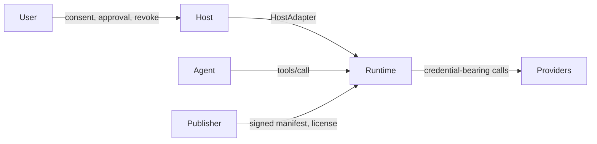
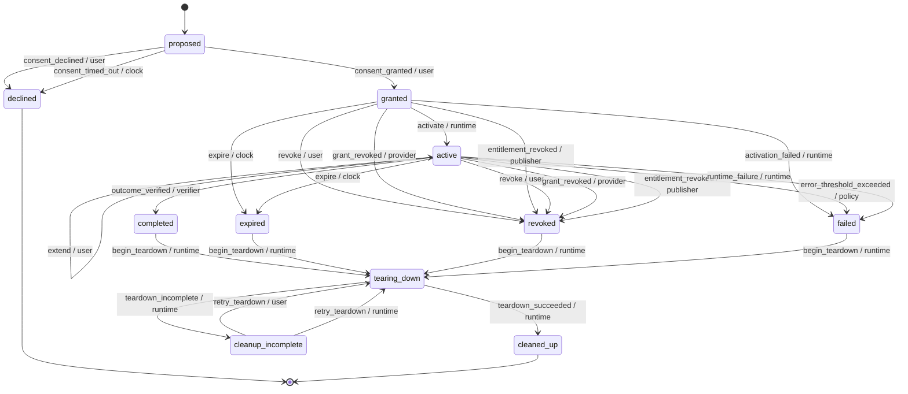

# Agent Lease Protocol (ALP), version alp/0.1

## 1. Introduction

Stint is a lease runtime for specialist AI agents. This document, the Agent Lease Protocol (ALP), specifies the human-facing lifecycle of an agent: install, run a scoped job, and uninstall cleanly.

The protocol's scope is exactly these three phases. Install means a user reviews a publisher's manifest and grants a lease. A scoped job means the agent operates only within the bounds the lease states, enforced by code the agent cannot influence. Uninstall means the lease ends, for any reason, and every credential the runtime holds on the agent's behalf is revoked, with the teardown honestly receipted.

ALP sits on top of two existing specifications and fills the gap each one leaves out of scope.

Rationale: the Model Context Protocol (MCP) defines how an agent discovers and calls tools, but it leaves user consent, revocation and uninstall out of scope; a host that implements only MCP has no normative way to say "this agent's access ends here, and here is proof it actually ended." OAuth 2.1 gives an agent's runtime delegated, scoped access tokens for a customer's own resources, but it has no concept of a lease: no bound duration, no bound job, and no teardown obligation tied to the lease's owner rather than to the token's issuer.

ALP serves two audiences equally. Platform builders host communities of agents and embed a runtime implementation with their own consent and approval user experience. Agent publishers ship specialist agents with a signed manifest, and where applicable a publisher-issued license, and in return receive attested receipts proving what their agent did.

The core guarantee this document specifies: a prompt-injected or otherwise misbehaving agent can never act outside the lease a user granted. Every tool call an agent makes is decided by code outside the model, running in a proxy the agent cannot bypass; the agent never holds a real credential that would let it act directly against a resource.

Non-goals: this document does not specify a marketplace or agent discovery mechanism; multi-agent delegation of a single lease to another agent; prompt-injection detection (the protocol's guarantee is that injection cannot exceed the lease, not that injection is detected or prevented); sandboxing of the agent process's own network egress (Section 13 documents this as a trust limit, not a mechanism this protocol provides); or a general-purpose policy DSL (the access vocabulary is the fixed set defined in Section 2, not an extensible rule language).

## 2. Conventions and Terminology

The key words "MUST", "MUST NOT", "REQUIRED", "SHALL", "SHALL NOT", "SHOULD", "SHOULD NOT", "RECOMMENDED", "MAY" and "OPTIONAL" in this document are to be interpreted as described in BCP 14 [RFC2119] [RFC8174] when, and only when, they appear in all capitals, as shown here.

Sections and notes beginning "Rationale:" are non-normative; they explain the reasoning behind a requirement but impose no obligation of their own.

Some wire-level details are not yet designed at this stage of the specification. Each such place carries an explicit marker, for example `[OPEN: Phase 2]`, naming the phase of the Stint project's own build that will define it. Implementations MUST NOT invent an interoperable format for anything marked with such a bracketed OPEN marker; a runtime or publisher MAY use a private, non-interoperable representation internally, but MUST NOT advertise cross-implementation compatibility of that representation until this document replaces the marker with a normative definition.

The following terms are used throughout this document:

- **Lease**: a bounded grant of access from a user to an agent, scoped to specific resources, access classes and limits, for at most a bounded duration.
- **Manifest**: a publisher-authored document describing an agent's job, requested scopes, limits, approvals and auth requirements, validated against the canonical manifest schema.
- **Signed Manifest Envelope**: a manifest plus a detached publisher signature over the manifest's canonical bytes.
- **Content Hash**: a self-describing hash of a manifest's canonically serialized bytes, bound to a lease at consent.
- **Runtime**: the software implementing this protocol: the state machine, the proxy, the credential vault and the teardown orchestrator. Operated by the user or a neutral party (Section 12).
- **Proxy**: the runtime component that sits between the agent and every system it touches, presenting an MCP server to the agent and enforcing the lease on every tool call.
- **Host**: the application embedding the runtime and presenting it to a user, via its HostAdapter.
- **HostAdapter**: the pluggable interface a host implements to render consent, per-call approval and lifecycle notifications.
- **Agent**: the publisher-authored process that calls tools through the proxy. Untrusted; never an actor in this protocol's transitions (Section 7.2).
- **Publisher**: the party that authors and signs a manifest, and in hosted or hybrid auth mode issues a license.
- **Provider**: the operator of a customer resource (for example a payments API or a spreadsheet API) that issues delegated OAuth grants.
- **Connector Binding**: a runtime-owned mapping from a tool name to a (resource, access class, irreversible) classification. Never derived from the manifest.
- **Resource**: an opaque identifier for something an agent can be granted access to, resolved by connector bindings.
- **Access Class**: one of the fixed values `read`, `write`, `send` or `pay`.
- **Grant**: a delegated OAuth authorization acquired from a provider for a specific resource.
- **License**: a publisher-issued, offline-verifiable token proving entitlement, used in hosted and hybrid auth modes.
- **Receipt**: an append-only record of one decision or outcome, hash-chained with every other receipt in its chain.
- **Verified Chain**: the hash chain of receipts the runtime itself observed and can prove.
- **Attested Chain**: the hash chain of receipts the runtime relays on trust from the publisher, without independent proof.
- **Checkpoint**: a signed statement summarizing a chain's head at a point in time, used to detect truncation or tampering.
- **Teardown**: the fixed, ordered sequence that runs whenever a lease ends, ending in a final signed receipt.
- **Actor**: the party the runtime attributes a transition to: `user`, `verifier`, `policy`, `clock`, `provider`, `publisher` or `runtime`.
- **Event**: the named occurrence that drives a lease from one state to another, as listed in Section 7.3.

## 3. Protocol Overview

ALP describes a small set of roles interacting around one lease at a time.

- The **user** grants and can end a lease, and is the only actor who can extend one.
- The **host** embeds the runtime and renders every consent and approval decision through its **HostAdapter**; the host trusts the runtime to enforce the lease, and the user trusts the host to render consent faithfully.
- The **runtime** is the software implementing this protocol. It runs an MCP **proxy** between the agent and every resource the agent might touch, holds the lease state machine, and orchestrates teardown.
- The **agent** is the publisher-authored process that calls tools through the proxy. The agent never holds a real credential: no OAuth access token, no license, no cleanup token. Every tool call the agent makes is decided by code outside the model, running in the proxy, which the agent cannot see or influence.
- The **publisher** authors and signs the manifest, and in hosted or hybrid auth mode issues a license.
- **Providers** operate the customer resources (a payments API, a spreadsheet API, and so on) that the agent's job touches, and issue delegated OAuth grants.

A short lifecycle walk-through: the host presents a publisher's signed manifest to the user (Section 6). If the user consents, the runtime binds the manifest's content hash to a new lease, acquires any delegated OAuth grants and any publisher license the auth mode requires, and activates the lease. While active, every tool call the agent makes passes through the proxy, which resolves the call to a runtime-owned connector binding, checks the lease's scopes and limits, and either allows it, denies it, or asks the user for approval through the HostAdapter. The lease ends for one of several reasons (Section 7), after which teardown (Section 10) runs its fixed sequence, and every step is honestly recorded in the receipt log (Section 11), whether it succeeds or not.

## 4. Manifest

<!-- ALP-PENDING: 01-05 -->

## 5. Signed Manifest Envelope and Content Hash

<!-- ALP-PENDING: 01-05 -->

## 6. Consent

<!-- ALP-PENDING: 01-05 -->

## 7. Lease Lifecycle

### 7.1 States

A lease occupies exactly one of eleven states at any time. Each state is either non-terminal (further transitions are possible) or terminal (no further transition is legal from it, per the transition table in Section 7.4).

- `proposed`: the runtime has verified the manifest and is presenting it to the user for consent. Non-terminal.
- `declined`: the user declined consent, or the consent request timed out. Terminal.
- `granted`: the user consented; the runtime is acquiring delegated grants and a license before activation. Non-terminal.
- `active`: the lease is live; the agent may call tools within its scope, and the outcome verifier, the clock, the policy engine, or any actor may end it. Non-terminal.
- `completed`: the outcome verifier confirmed the job's outcome. Non-terminal (teardown follows).
- `expired`: the lease's maximum duration elapsed. Non-terminal (teardown follows).
- `revoked`: the user, a resource provider, or the publisher ended the lease early. Non-terminal (teardown follows).
- `failed`: the policy engine's error threshold was exceeded, or the runtime itself failed. Non-terminal (teardown follows).
- `tearing_down`: the teardown orchestrator is running its fixed sequence of steps. Non-terminal.
- `cleaned_up`: teardown completed every step successfully. Terminal.
- `cleanup_incomplete`: at least one teardown step did not complete. Non-terminal, since a retry can resume it.

Rationale: `declined` and `cleaned_up` are the only two states with no outgoing transition in Section 7.4's table. Every other ending state (`completed`, `expired`, `revoked`, `failed`) funnels into `tearing_down`, and `cleanup_incomplete` can only return to `tearing_down`, never to `active`.

### 7.2 Actors

Every transition in Section 7.4 is attributed to exactly one of seven actors:

- `user`: the human who consented to the lease. Causes `consent_granted`, `consent_declined`, `revoke`, `extend` and `retry_teardown`.
- `verifier`: the outcome verification mechanism named in the manifest's `job.verifier` (Section 7.6). Causes `outcome_verified`.
- `policy`: the runtime's policy engine, evaluating limits such as the error threshold. Causes `error_threshold_exceeded`.
- `clock`: the runtime's injected clock, evaluated on every call rather than by a timer (Section 7.5). Causes `consent_timed_out` and `expire`.
- `provider`: the operator of a customer resource whose OAuth grant was revoked. Causes `grant_revoked`.
- `publisher`: the agent's publisher, revoking entitlement. Causes `entitlement_revoked`.
- `runtime`: the runtime itself, driving activation, failure, teardown and its own retries. Causes `activate`, `activation_failed`, `runtime_failure`, `begin_teardown`, `teardown_succeeded`, `teardown_incomplete` and `retry_teardown`.

The agent is never an actor: no event originating from the agent, including any tool call, tool result or message claiming completion, ends, extends or completes a lease. The runtime MUST attribute each event to the actor that actually produced it: an event's actor is not a caller-supplied claim but a fact the runtime itself establishes from the source of the trigger (a resolved user action, an evaluated predicate, an injected clock, a response from a provider or publisher, or the runtime's own code).

### 7.3 Events

- `consent_granted` (actor `user`): the user approved the manifest presented in `proposed`.
- `consent_declined` (actor `user`): the user declined the manifest presented in `proposed`.
- `consent_timed_out` (actor `clock`): the consent request was not answered before its timeout.
- `activate` (actor `runtime`): every delegated grant is acquired, a license is issued where required, and the presented manifest's content hash equals the consented hash.
- `activation_failed` (actor `runtime`): activation's guards did not hold (Section 7.4).
- `revoke` (actor `user`): the user ended the lease early.
- `grant_revoked` (actor `provider`): a provider revoked one of the lease's delegated OAuth grants.
- `entitlement_revoked` (actor `publisher`): the publisher revoked the agent's entitlement.
- `expire` (actor `clock`): the lease's `lease.max_duration_seconds` elapsed, evaluated against the injected clock.
- `extend` (actor `user`): the user granted fresh consent to move the lease's expiry further out (Section 7.5).
- `outcome_verified` (actor `verifier`): the manifest's `job.verifier` confirmed the job's outcome (Section 7.6).
- `error_threshold_exceeded` (actor `policy`): the manifest's `limits.error_threshold` was exceeded.
- `runtime_failure` (actor `runtime`): the runtime itself failed, including a content-hash mismatch detected on resume.
- `begin_teardown` (actor `runtime`): the runtime started the fixed teardown sequence (Section 10) after any ending state.
- `teardown_succeeded` (actor `runtime`): every teardown step completed.
- `teardown_incomplete` (actor `runtime`): at least one teardown step did not complete.
- `retry_teardown` (actor `user` or `runtime`): teardown was retried from `cleanup_incomplete`.

### 7.4 Transition Table

The following table is normative. Any (state, event, actor) triple not listed here MUST be rejected by an implementation and MUST NOT change the lease's state.

| From | Event | Actor | To |
|------|-------|-------|----|
| proposed | consent_granted | user | granted |
| proposed | consent_declined | user | declined |
| proposed | consent_timed_out | clock | declined |
| granted | activate | runtime | active |
| granted | activation_failed | runtime | failed |
| granted | revoke | user | revoked |
| granted | grant_revoked | provider | revoked |
| granted | entitlement_revoked | publisher | revoked |
| granted | expire | clock | expired |
| active | extend | user | active |
| active | outcome_verified | verifier | completed |
| active | expire | clock | expired |
| active | revoke | user | revoked |
| active | grant_revoked | provider | revoked |
| active | entitlement_revoked | publisher | revoked |
| active | error_threshold_exceeded | policy | failed |
| active | runtime_failure | runtime | failed |
| completed | begin_teardown | runtime | tearing_down |
| expired | begin_teardown | runtime | tearing_down |
| revoked | begin_teardown | runtime | tearing_down |
| failed | begin_teardown | runtime | tearing_down |
| tearing_down | teardown_succeeded | runtime | cleaned_up |
| tearing_down | teardown_incomplete | runtime | cleanup_incomplete |
| cleanup_incomplete | retry_teardown | user | tearing_down |
| cleanup_incomplete | retry_teardown | runtime | tearing_down |

`activate` is guarded: the presented manifest's content hash MUST equal the hash bound at consent, every delegated grant listed in `auth.delegated` MUST be acquired (delegated and hybrid modes), and a license MUST be issued (hosted and hybrid modes). A content-hash mismatch detected at activation yields `activation_failed`; the same mismatch detected on a runtime resume (for example after a restart) yields `runtime_failure` instead, since the lease was already active.

Every accepted transition MUST be recorded as a receipt with its actor (Section 11); the entry format for that receipt is `[OPEN: Phase 3]`.

Rationale: implementations SHOULD derive their state-machine reducer directly from this table, as a data structure rather than nested conditional logic, so that whether a transition is legal becomes a lookup rather than a re-derivation of the rules above.

### 7.5 Expiry, Extension and License Refresh

A lease's `expires_at` equals the time it was granted plus the manifest's `lease.max_duration_seconds`. The runtime MUST evaluate expiry on every tool call against its own clock; correctness MUST NOT depend on a timer that fires independently of calls (Section 13 documents the corresponding trust limit around detection latency).

`extend` is the only transition that moves `expires_at`, and it requires fresh user consent through the HostAdapter; a runtime MUST NOT extend a lease on the agent's request alone. The shape and bounds of an extension request are `[OPEN: Phase 2]`.

License refresh is distinct from lease extension. Refresh is routine and runtime-driven: the runtime renews a hosted or hybrid lease's license before its short TTL expires, without any user interaction. Refresh MUST NOT move `expires_at`, and no refreshed license may carry an expiry later than the lease's own `expires_at`. Token expiry, whether of a license or of a delegated OAuth grant, is not the same thing as entitlement ending; a token can expire and be refreshed many times across one lease's lifetime.

The runtime MUST re-check the manifest's content hash against the hash bound at consent both at activation and whenever the runtime resumes a lease it did not itself keep running continuously (for example after a process restart). A mismatch at activation yields `activation_failed`; a mismatch on resume yields `runtime_failure` (Section 7.3).

### 7.6 Outcome Verification

The manifest's `job.verifier` (Section 4) determines how, if at all, a lease reaches `completed`:

- `resource_query`: the runtime evaluates `job.verifier.predicate` against `job.verifier.resource` through the proxy, using runtime-held credentials, never publisher-supplied code. The predicate grammar is `[OPEN: Phase 5]`.
- `user_confirm`: the runtime asks the user, through the HostAdapter, whether the job's outcome is acceptable, using `job.verifier.prompt`.
- `none`: `completed` is unreachable for this lease; the lease can only end by expiry or by a user or policy action (Section 7.4).

An agent's own claim of being done, whether a tool result, a message, or any other agent-originated signal, never completes a lease; only the verifier actor, established by one of the mechanisms above, causes `outcome_verified` (Section 7.2).

## 8. Authorization Modes

A manifest's `auth.mode` is one of `delegated`, `hosted` or `hybrid`. `hybrid` is the default when `auth.mode` is absent.

- `delegated`: the runtime acquires one delegated OAuth grant per entry in `auth.delegated`, each linking a `provider` to the `resources` it grants access to. OAuth endpoints and client configuration are runtime connector configuration; they are never supplied by the publisher manifest. Access tokens carry RFC 8707 resource indicators and are injected by the proxy only on outbound calls; they are never returned to the agent. If any one customer grant is revoked, whether detected explicitly or lazily via `invalid_grant` or an HTTP 401 from the provider, the runtime MUST revoke the whole lease with actor `provider`.
- `hosted`: the publisher issues a PASETO v4.public license, identified by `auth.hosted.license_issuer` and optionally `auth.hosted.kid`, with a default TTL of 300 seconds. The TTL is not carried in the manifest. The license's claims and the derivation of any implicit assertions are `[OPEN: Phase 3]`. The runtime holds the license; the agent never does, and the license MUST NOT be forwarded to any customer resource.
- `hybrid`: both of the above apply together, a license for entitlement and delegated OAuth grants for customer resources.

## 9. Enforcement

## 10. Teardown

## 11. Receipts

## 12. Trust Model

## 13. Trust Limits

## 14. Security Considerations

## 15. Conformance

<!-- ALP-PENDING: 01-05 -->

## 16. References
