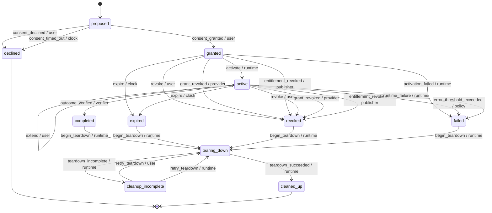

# Agent Lease Protocol (ALP), version alp/0.1

## 1. Introduction

Stint is a lease runtime for specialist AI agents. This document, the Agent Lease Protocol (ALP), specifies the human-facing lifecycle of an agent: install, run a scoped job, and uninstall cleanly.

The protocol's scope is exactly these three phases. Install means a user reviews a publisher's manifest and grants a lease. A scoped job means the agent operates only within the bounds the lease states, enforced by code the agent cannot influence. Uninstall means the lease ends, for any reason, and every credential the runtime holds on the agent's behalf is revoked, with the teardown honestly receipted.

ALP sits on top of two existing specifications and fills the gap each one leaves out of scope.

Rationale: the Model Context Protocol (MCP) defines how an agent discovers and calls tools, but it leaves user consent, revocation and uninstall out of scope; a host that implements only MCP has no normative way to say "this agent's access ends here, and here is proof it actually ended." OAuth 2.1 gives an agent's runtime delegated, scoped access tokens for a customer's own resources, but it has no concept of a lease: no bound duration, no bound job, and no teardown obligation tied to the lease's owner rather than to the token's issuer.

ALP serves two audiences equally. Platform builders host communities of agents and embed a runtime implementation with their own consent and approval user experience. Agent publishers ship specialist agents with a signed manifest, and where applicable a publisher-issued license, and in return receive attested receipts proving what their agent did.

The core guarantee this document specifies: a prompt-injected or otherwise misbehaving agent can never act outside the lease a user granted. Every tool call an agent makes is decided by code outside the model, running in a proxy the agent cannot bypass; the agent never holds a real credential that would let it act directly against a resource.

Non-goals: this document does not specify a marketplace or agent discovery mechanism; multi-agent delegation of a single lease to another agent; prompt-injection detection (the protocol's guarantee is that injection cannot exceed the lease, not that injection is detected or prevented); sandboxing of the agent process's own network egress (Section 13 documents this as a trust limit, not a mechanism this protocol provides); or a general-purpose policy DSL (the access vocabulary is the fixed set defined in Section 2, not an extensible rule language).

## 2. Conventions and Terminology

The key words "MUST", "MUST NOT", "REQUIRED", "SHALL", "SHALL NOT", "SHOULD", "SHOULD NOT", "RECOMMENDED", "MAY" and "OPTIONAL" in this document are to be interpreted as described in BCP 14 [RFC2119] [RFC8174] when, and only when, they appear in all capitals, as shown here.

Sections and notes beginning "Rationale:" are non-normative; they explain the reasoning behind a requirement but impose no obligation of their own.

Some wire-level details are not yet designed at this stage of the specification. Each such place carries an explicit marker, for example `[OPEN: Phase 2]`, naming the phase of the Stint project's own build that will define it. Implementations MUST NOT invent an interoperable format for anything marked with such a bracketed OPEN marker; a runtime or publisher MAY use a private, non-interoperable representation internally, but MUST NOT advertise cross-implementation compatibility of that representation until this document replaces the marker with a normative definition.

The following terms are used throughout this document:

- **Lease**: a bounded grant of access from a user to an agent, scoped to specific resources, access classes and limits, for at most a bounded duration.
- **Manifest**: a publisher-authored document describing an agent's job, requested scopes, limits, approvals and auth requirements, validated against the canonical manifest schema.
- **Signed Manifest Envelope**: a manifest plus a detached publisher signature over the manifest's canonical bytes.
- **Content Hash**: a self-describing hash of a manifest's canonically serialized bytes, bound to a lease at consent.
- **Runtime**: the software implementing this protocol: the state machine, the proxy, the credential vault and the teardown orchestrator. Operated by the user or a neutral party (Section 12).
- **Proxy**: the runtime component that sits between the agent and every system it touches, presenting an MCP server to the agent and enforcing the lease on every tool call.
- **Host**: the application embedding the runtime and presenting it to a user, via its HostAdapter.
- **HostAdapter**: the pluggable interface a host implements to render consent, per-call approval and lifecycle notifications.
- **Agent**: the publisher-authored process that calls tools through the proxy. Untrusted; never an actor in this protocol's transitions (Section 7.2).
- **Publisher**: the party that authors and signs a manifest, and in hosted or hybrid auth mode issues a license.
- **Provider**: the operator of a customer resource (for example a payments API or a spreadsheet API) that issues delegated OAuth grants.
- **Connector Binding**: a runtime-owned mapping from a tool name to a (resource, access class, irreversible) classification. Never derived from the manifest.
- **Resource**: an opaque identifier for something an agent can be granted access to, resolved by connector bindings.
- **Access Class**: one of the fixed values `read`, `write`, `send` or `pay`.
- **Grant**: a delegated OAuth authorization acquired from a provider for a specific resource.
- **License**: a publisher-issued, offline-verifiable token proving entitlement, used in hosted and hybrid auth modes.
- **Receipt**: an append-only record of one decision or outcome, hash-chained with every other receipt in its chain.
- **Verified Chain**: the hash chain of receipts the runtime itself observed and can prove.
- **Attested Chain**: the hash chain of receipts the runtime relays on trust from the publisher, without independent proof.
- **Checkpoint**: a signed statement summarizing a chain's head at a point in time, used to detect truncation or tampering.
- **Teardown**: the fixed, ordered sequence that runs whenever a lease ends, ending in a final signed receipt.
- **Actor**: the party the runtime attributes a transition to: `user`, `verifier`, `policy`, `clock`, `provider`, `publisher` or `runtime`.
- **Event**: the named occurrence that drives a lease from one state to another, as listed in Section 7.3.

## 3. Protocol Overview

## 4. Manifest

<!-- ALP-PENDING: 01-05 -->

## 5. Signed Manifest Envelope and Content Hash

<!-- ALP-PENDING: 01-05 -->

## 6. Consent

<!-- ALP-PENDING: 01-05 -->

## 7. Lease Lifecycle

### 7.1 States

A lease occupies exactly one of eleven states at any time. Each state is either non-terminal (further transitions are possible) or terminal (no further transition is legal from it, per the transition table in Section 7.4).

- `proposed`: the runtime has verified the manifest and is presenting it to the user for consent. Non-terminal.
- `declined`: the user declined consent, or the consent request timed out. Terminal.
- `granted`: the user consented; the runtime is acquiring delegated grants and a license before activation. Non-terminal.
- `active`: the lease is live; the agent may call tools within its scope, and the outcome verifier, the clock, the policy engine, or any actor may end it. Non-terminal.
- `completed`: the outcome verifier confirmed the job's outcome. Non-terminal (teardown follows).
- `expired`: the lease's maximum duration elapsed. Non-terminal (teardown follows).
- `revoked`: the user, a resource provider, or the publisher ended the lease early. Non-terminal (teardown follows).
- `failed`: the policy engine's error threshold was exceeded, or the runtime itself failed. Non-terminal (teardown follows).
- `tearing_down`: the teardown orchestrator is running its fixed sequence of steps. Non-terminal.
- `cleaned_up`: teardown completed every step successfully. Terminal.
- `cleanup_incomplete`: at least one teardown step did not complete. Non-terminal, since a retry can resume it.

Rationale: `declined` and `cleaned_up` are the only two states with no outgoing transition in Section 7.4's table. Every other ending state (`completed`, `expired`, `revoked`, `failed`) funnels into `tearing_down`, and `cleanup_incomplete` can only return to `tearing_down`, never to `active`.

### 7.2 Actors

### 7.3 Events

### 7.4 Transition Table

### 7.5 Expiry, Extension and License Refresh

### 7.6 Outcome Verification

## 8. Authorization Modes

## 9. Enforcement

## 10. Teardown

## 11. Receipts

## 12. Trust Model

## 13. Trust Limits

## 14. Security Considerations

## 15. Conformance

<!-- ALP-PENDING: 01-05 -->

## 16. References
